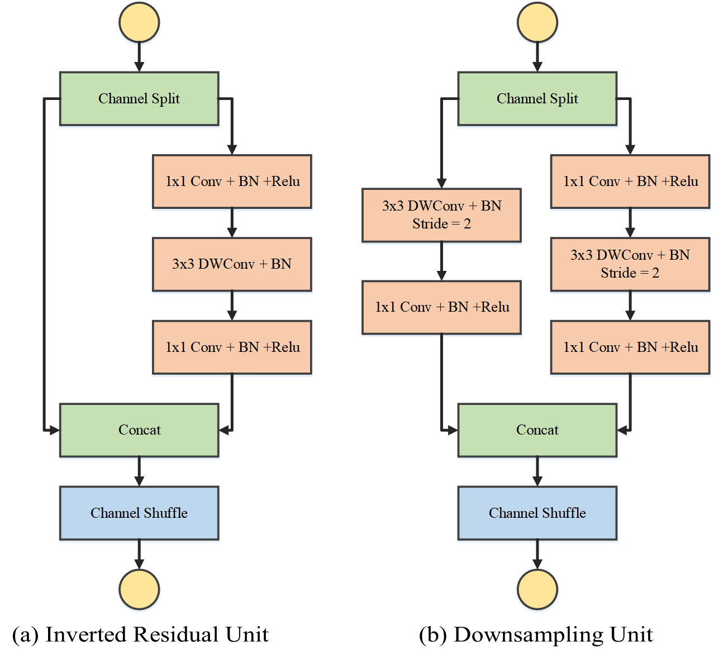

# ESS-SLAM
Repository for the paper "Efficient Self-Supervised Feature for Robust Robot Visual SLAM". [In Proceeding]

## Network Architecture

The feature detection and description network is built in an efficient manner following the practical guidelines of ShuffleNet V2. As illustrated in Fig. 1, the network consists of 2 basic units. Both units split the input tensor along the channel evenly first. The inverted residual unit applies the pointwise(1x1 Conv) and depthwise(3x3 DWConv) convolutional layers instead of normal convolutional layers to decrease the FLOPs. The Downsampling unit utilize the depthwise convolutional layers with stride = 2 to replace the pooling layer. The splited channels are concated after the convolution operations. Finally, the channel shuffle before the output provides extra receptive field for learning.

Fig. 1  Network Basic Units

## Training Details
The proposed network is trained by a 4-GTX1080Ti workstation. For initial training with the artificial corner dataset, the shared feature extractor and the keypoint branch are trained by Adam optimizer for 80 epochs. The batch size is set to 128, and the learning rate is set to 10E-4 with half decay for every 20 epochs. 

For iterative joint training, the cropped COCO and KITTI datasets are applied along with the 2D transformation data augmentation. The network is also trained by Adam optimizer for 200 epochs. The batch size is set to 32, and the learning rate is set to 10E-4 with a 10% decay for every 40 epochs. The joint training is iterated till convergence or for six rounds at most.

